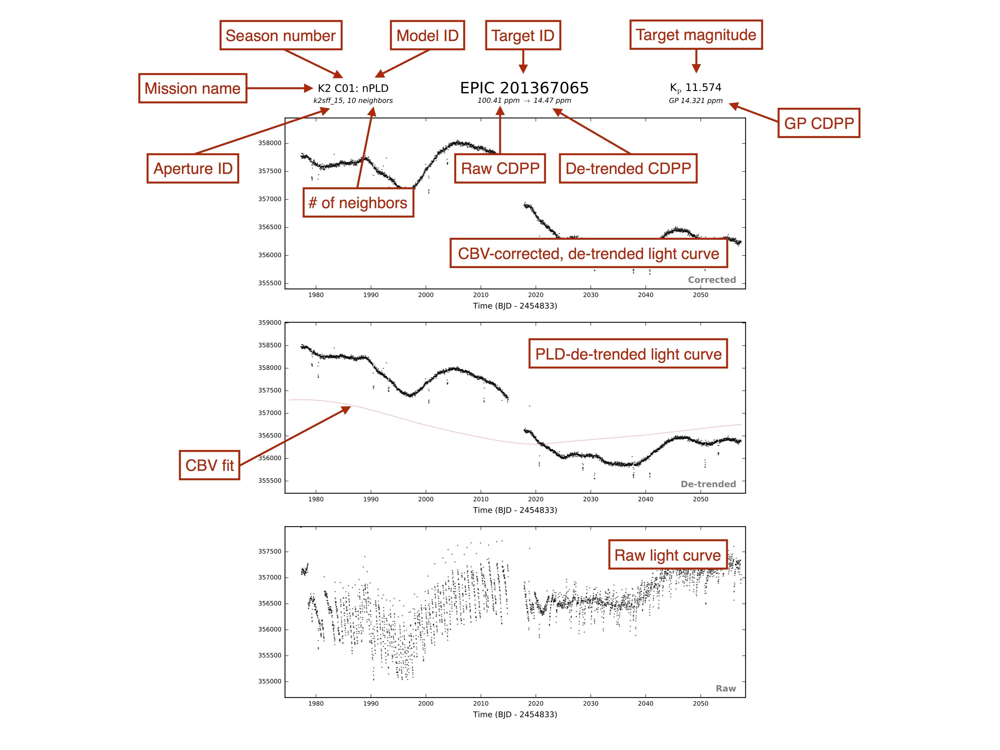

Data Validation Summaries
=========================

Data Validation Summary (DVS) plots are available for all targets de-trended
with :py:obj:`everest`. They are included in the `MAST catalog <https://archive.stsci.edu/prepds/everest/>`_
as :py:obj:`.pdf` files and are named according to the :py:obj:`everest` model that
generated them (i.e., :py:obj:`nPLD.pdf`). They can easily be accessed via the
:py:obj:`everest` user interface:

.. code-block:: python

   import everest
   everest.DVS(201367065)

The DVS files contain two pages. The first is a summary figure showing the final CBV-corrected
flux, the PLD-de-trended flux, and the raw flux. The second page contains various plots
concerning the PLD-de-trending.

Below is an annotated example of the first page for the :py:obj:`K2` target `EPIC 201367065`, a
campaign 1 planet host.

And here is the second page for the same target:

.. figure:: dvs2.jpg
   :width: 800px
   :align: center
   :figclass: align-center

.. warning :: Sometimes, very deep transits can get cut off from the plots. This is \
              particularly a problem for the early campaigns of :py:obj:`K2`, where \
              many deep transits and eclipses were flagged by the `Kepler` team as \
              having poor :py:obj:`QUALITY`. We adjust the limits of the plots based \
              on the *valid* data points, so sometimes these transit can get cut off. \
              So if a deep transit is missing in the plot, it's likely still there! \
              Make sure to plot the light curve via the Python interface and zoom out \
              to see it.
              