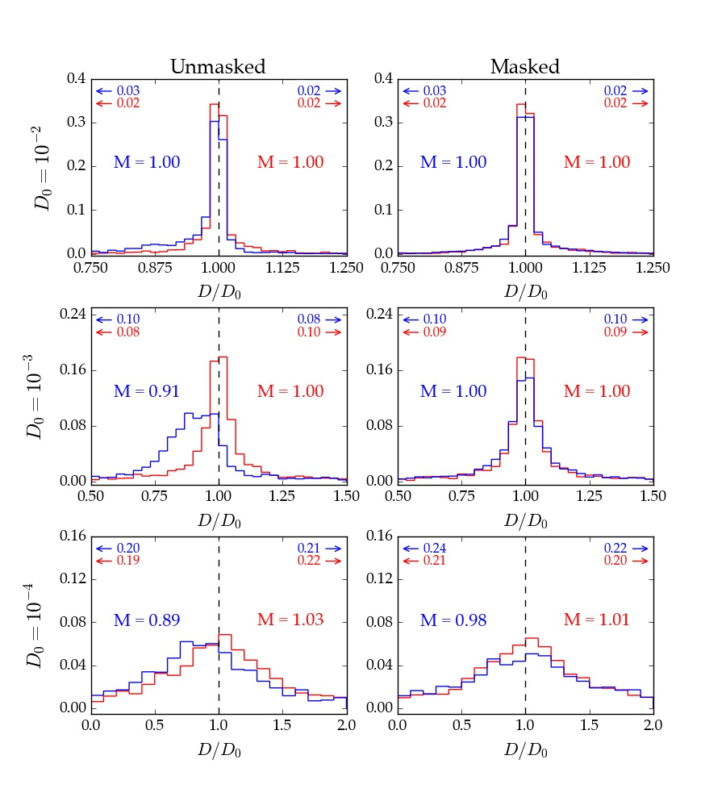

:py:mod:`everest-stats` - De-trending Statistics
------------------------------------------------

The :py:mod:`everest-stats` command accepts several options, which we list below.

+--------------------------+---------------------------------------------------------------------------------+
| :py:obj:`season`         | | The season number. For :py:obj:`K2`, this is the campaign number. Note that   |
|                          | | fractional seasons are allowed (i.e., 6.0). Default is 0                      |
+--------------------------+---------------------------------------------------------------------------------+
| :py:obj:`model`          | | The :py:obj:`everest` model name. Default :py:class:`nPLD`                    |
+--------------------------+---------------------------------------------------------------------------------+
| :py:obj:`compare_to`     | | The :py:obj:`everest` model or pipeline to compare against.                   |
|                          | | Default :py:obj:`everest1`                                                    |
+--------------------------+---------------------------------------------------------------------------------+
| :py:obj:`-m` `mission`   | | The mission name (:py:obj:`k2` | :py:obj:`kepler` | :py:obj:`tess`).          |
|                          | | Default :py:obj:`k2`                                                          |
+--------------------------+---------------------------------------------------------------------------------+
| :py:obj:`-s`             | | Plot the short cadence versus long cadence CDPP statistics.                   |
|                          | | If no campaign is specified, shows all campaigns                              |
+--------------------------+---------------------------------------------------------------------------------+
| :py:obj:`-p`             | | Plot the CDPP comparison for all confirmed planet hosts                       |
+--------------------------+---------------------------------------------------------------------------------+
| :py:obj:`-i`             | | Plot the transit injection/recovery results.                                  |
+--------------------------+---------------------------------------------------------------------------------+

If no flags are specified, :py:mod:`everest-stats` shows several plots for a given season, comparing :py:obj:`everest`
to a different PLD model or a different mission pipeline. For :py:obj:`K2`, running

.. code-block :: bash
   
   everest-stats 6 nPLD k2sff

produces the following plot:

.. figure:: estats_6.jpeg
   :width: 800px
   :align: center
   :figclass: align-center

On the left is the CDPP as a function of `Kepler` magnitude for all stars in campaign 6, de-trended
with :py:mod:`nPLD` (blue dots) and the :py:mod:`k2sff` pipeline (yellow dots). The median CDPP
is indicated by the circles.

In the center is the normalized relative CDPP, given by

.. math ::

   \mathrm{(CDPP_{nPLD} - CDPP_{k2sff})/CDPP_{k2sff}}

Negative values correspond to lower CDPP in the :py:mod:`nPLD` light curves. Blue dots are
unsaturated stars and red dots are saturated stars; the median relative CDPP is indicated
by the black lines (solid for unsaturated, dashed for saturated).

On the right we show histograms for the number of outliers (top) and the total number of 
data points (bottom) for each pipeline.

**All points in the first two plots are clickable**. Clicking on them will bring up the 
DVS plots for both pipelines/models for easy comparison.

Short Cadence
=============

The :py:obj:`-s` option allows users to view a comparison between the short cadence and long
cadence de-trended light curves. As usual, we plot the normalized relative CDPP. 
As before, points are clickable and bring up the DVS plots for both the short
and long cadence light curves.

.. figure:: estats_sc.jpeg
   :width: 400px
   :align: center
   :figclass: align-center

Planets
=======

The :py:obj:`-p` option allows users to view the statistics for only the confirmed planet
hosts. Below is a figure comparing :py:obj:`everest` to :py:obj:`k2sff`:

.. figure:: estats_planets.jpeg
   :width: 400px
   :align: center
   :figclass: align-center

Injections
==========

The :py:obj:`-i` option plots the results of transit injection/recovery tests. See Figure
6 in `Luger et al. (2016) <http://adsabs.harvard.edu/abs/2016AJ....152..100L>`_ for more
information.

.. note :: For :py:obj:`K2`, only campaign 6.0 is available. For other campaigns, \
           the user must run the transit injections themselves. See :doc:`Transit injection <inject>`.

.. raw:: html

  