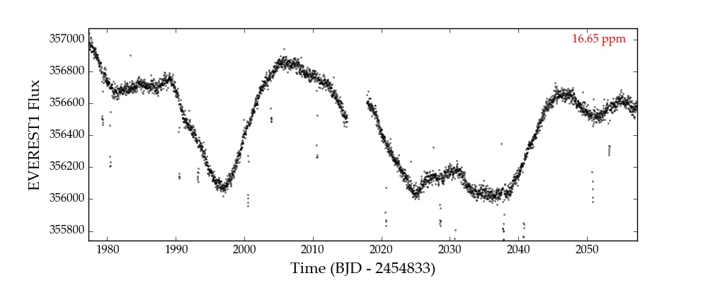
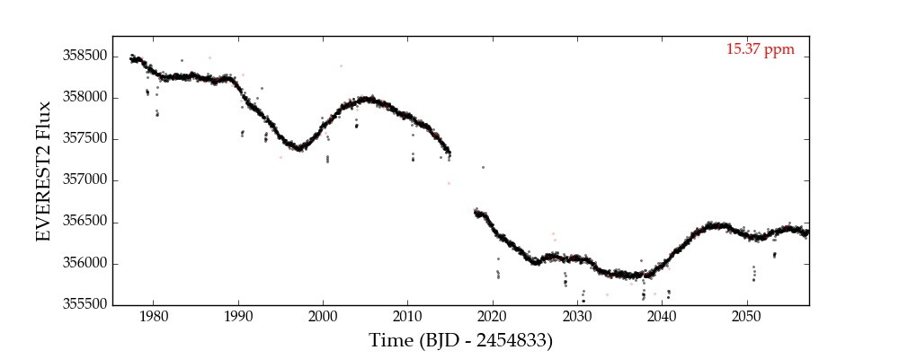
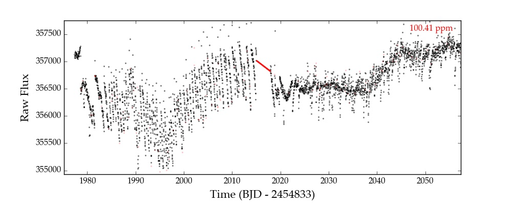

:py:mod:`everest` - Command line access
---------------------------------------

.. role:: python(code)
   :language: python

The :py:mod:`everest` command accepts several options, which we list below.

======================  =============================================================================================
:py:obj:`ID`            The target :py:obj:`ID` number (`required`)
:py:obj:`-1`            Plot the :py:obj:`everest 1.0` de-trended light curve (:py:obj:`K2` `only`)
:py:obj:`-2`            Plot the :py:obj:`everest 2.0` de-trended light curve (`default`)
:py:obj:`-a`            Plot the target aperture/postage stamp
:py:obj:`-c` `cadence`  Cadence type (:py:obj:`lc` | :py:obj:`sc`). Default :py:obj:`lc`
:py:obj:`-d`            Show the :py:obj:`everest 2.0` data validation summary
:py:obj:`-f`            Plot the :py:obj:`k2sff` light curve for the target (:py:obj:`K2` `only`)
:py:obj:`-h`            Show the help message and exit
:py:obj:`-m` `mission`  The mission name (:py:obj:`k2` | :py:obj:`kepler` | :py:obj:`tess`). Default :py:obj:`k2`
:py:obj:`-n`            Do not apply the CBV correction
:py:obj:`-r`            Plot the raw light curve
:py:obj:`-s`            Plot the :py:obj:`k2sc` light curve for the target (:py:obj:`K2` `only`)
======================  =============================================================================================

This tool implements most of the basic :py:mod:`everest` functionality. It automatically
downloads light curves and data validation summaries from MAST and plots them with some
customization. Below we show some examples. For other options and further customization,
see the :doc:`Python user interface <user>` section. 

Everest 1
=========

The :py:obj:`-1` option brings up the light curve de-trended with version 1 of the pipeline:

Everest 2
=========

The :py:obj:`-2` option (default, if no flags are present) shows the light curve de-trended 
with the current version (2) of the pipeline:

.. figure:: everest_2.jpeg
   :width: 600px
   :align: center
   :figclass: align-center

If the :py:obj:`-n` flag is present, the code does not apply the CBV correction, resulting
in a light curve with a bit more low-frequency residual systematics:

   
Other pipelines
===============

Other supported pipelines can be plotted with the :py:obj:`--pipeline_name` flag,
or with the abbreviated flags (i.e., :py:obj:`-f` for :py:obj:`k2sff` or
:py:obj:`-s` for :py:obj:`k2sc`). Here's the plot for :python:`everest 201367065 --k2sff`:

.. figure:: everest_k2sff.jpg
   :width: 600px
   :align: center
   :figclass: align-center

Raw
===

The :py:obj:`-r` option brings up the raw light curve:

   
Data Validation Summary
=======================

See :doc:`Data Validation Summary <dvsfigs>`.

Aperture
========

Nothing too fancy. The :py:obj:`-a` flag plots the postage stamp with the aperture
used to de-trend:

.. figure:: everest_a.jpeg
   :width: 300px
   :align: center
   :figclass: align-center

The plots show snapshots of the postage stamp at the beginning of the timeseries (**start**),
the middle of the timeseries (**mid**) and the end of the timeseries (**end**). The
final plot (**hires**) is a high resolution image of the target. For :py:obj:`K2`, this
is taken from the Palomary Observatory Sky Survey.