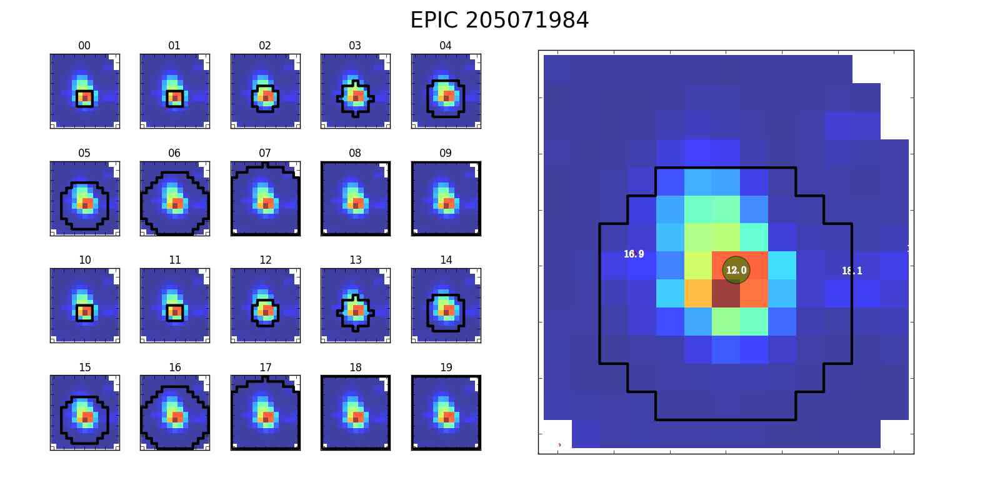
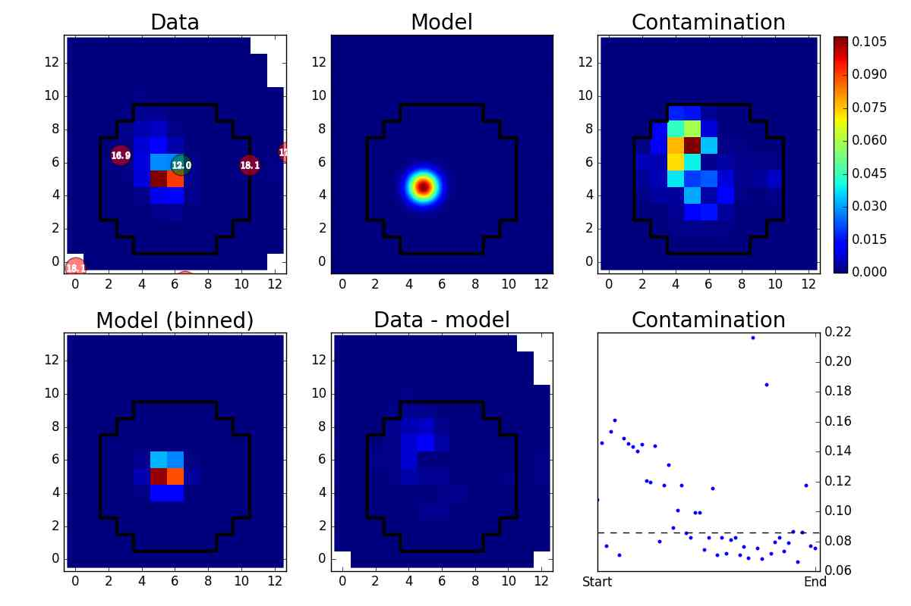
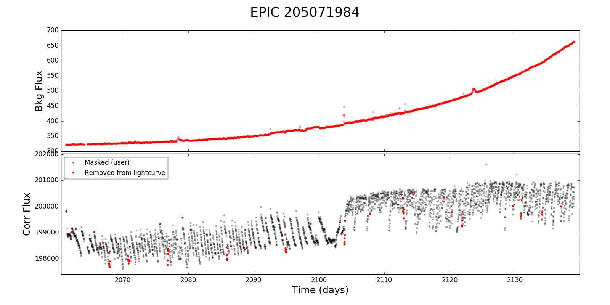
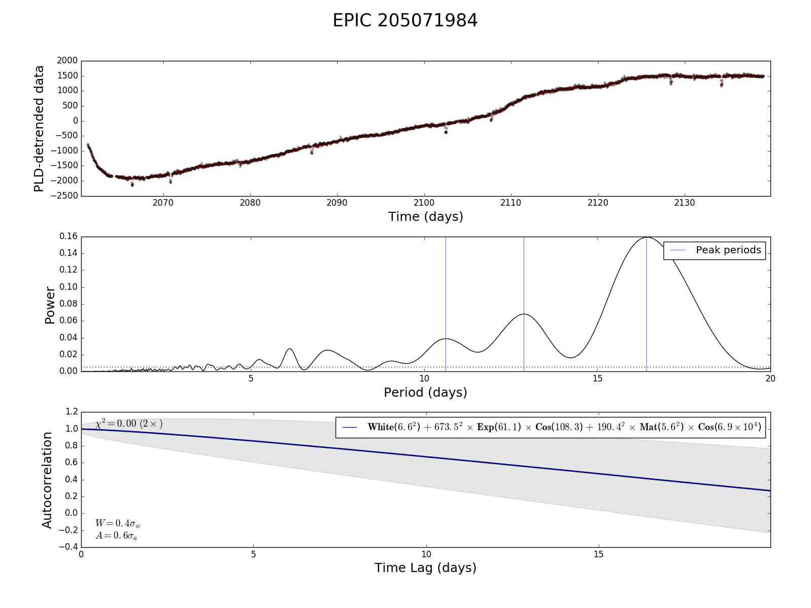
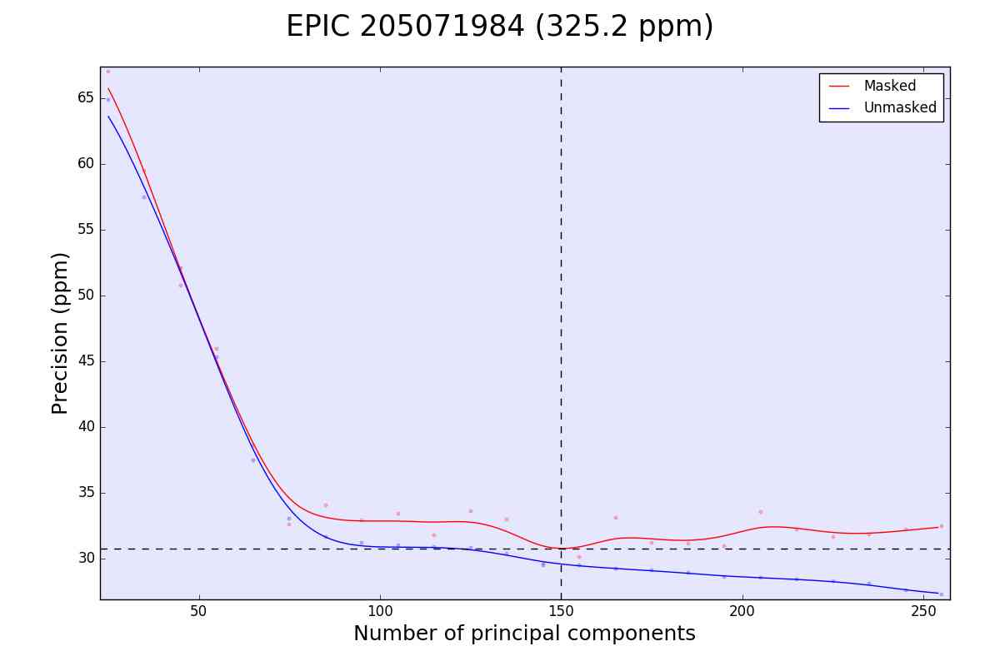
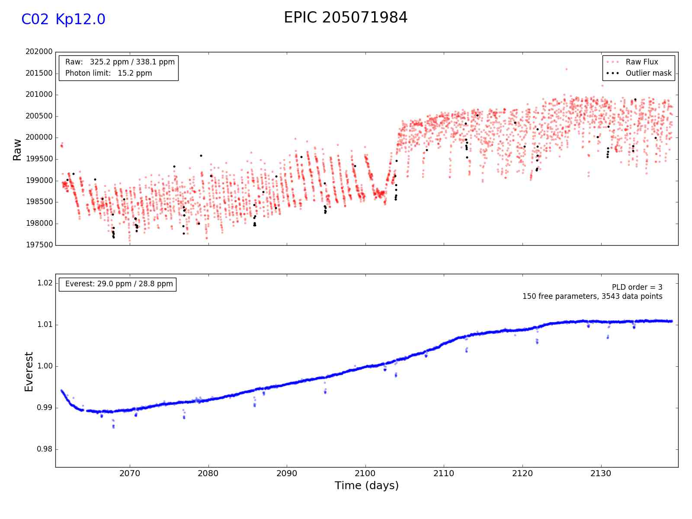

Figures
=======

.. contents::
   :local:

Aperture
~~~~~~~~

Contamination
~~~~~~~~~~~~~

Outliers
~~~~~~~~

Autocorrelation
~~~~~~~~~~~~~~~

Cross-validation
~~~~~~~~~~~~~~~~

De-trended
~~~~~~~~~~

