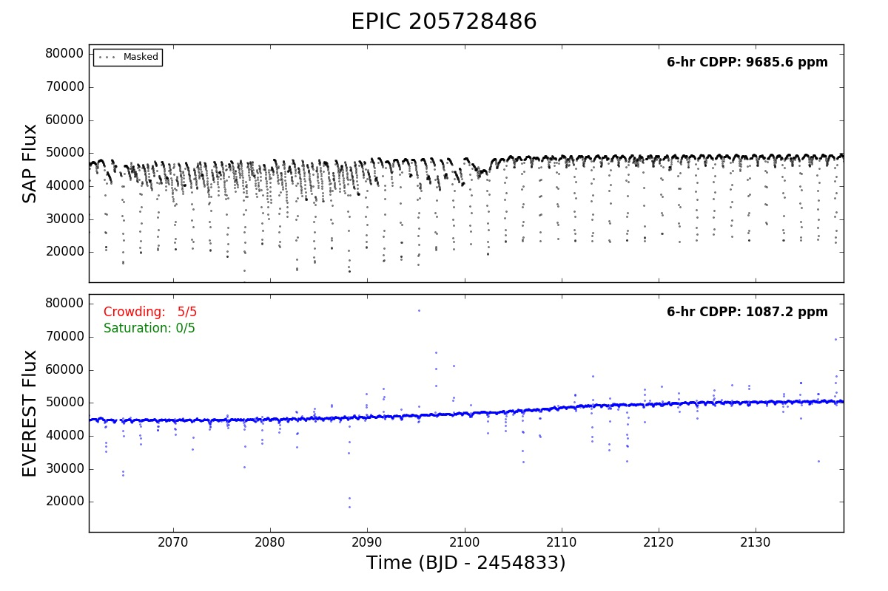

Known Issues
============

As we discuss in the paper, **EVEREST** has certain limitations, particularly when
it comes to saturated stars and stars in crowded apertures. Below we outline these
limitations with some examples.

.. contents::
   :local:

Stars in crowded apertures
~~~~~~~~~~~~~~~~~~~~~~~~~~

Pixel level decorrelation does not work well when there are contaminating sources
in the aperture. This is because PLD uses the *normalized* pixel intensities, which
are computed by dividing the pixel fluxes by the total flux in the aperture. When
the target is the only source in the aperture, this removes all astrophysical signals
from the PLD basis vectors (since they are present with the same fractional
intensity across all pixels). However, when there are contaminating sources in the
aperture, this normalization step does not succeed in removing all astrophysical
information (i.e., transits, eclipses, and stellar variability) from the basis vectors.
PLD can therefore easily fit out these features during de-trending (which actually
results in an apparently better fit). EPIC 205728486 is an eclipsing binary in an
aperture with significant contamination -- note how the eclipses, which are visible
in the raw data, are washed out in the de-trended data. If you see changing eclipse/transit
depths and inverted transits as in this example, the star is likely in a crowded
aperture (it could also be saturated -- see below). The ``Crowding`` flag at the top
left of the bottom panel is a rough measure of the contamination. For any sources
with ``Crowding`` greater than 2 or 3, we recommend comparing the :py:mod:`everest`
light curves to light curves from other pipelines such as **K2SFF** and **K2SC**, which
are less sensitive to this issue.

Highly saturated stars
~~~~~~~~~~~~~~~~~~~~~~

.. figure:: 201270464.jpeg
 :width: 600px
 :align: center
 :height: 100px
 :figclass: align-center

Stars brighter than about magnitude 11 in the `Kepler` band are likely to be saturated,
meaning that one or more pixels max out, leading to charge overflow into adjacent
pixels. While astrophysical signals are mostly preserved in the total (SAP) flux,
the same is not true across the individual pixels. Transit depths will be much
shallower in the saturated pixels and deeper in the "overflow" pixels at the top
and bottom of the charge bleed trails. PLD performs quite poorly in these cases; much
like the case with crowded apertures, the PLD basis vectors end up containing astrophysical
information, which can then be easily removed during de-trending. EPIC 201270464 is
a saturated *Kp = 9.4* eclipsing binary. The eclipses are somewhat visible in the 
raw flux (particularly in the second half of the campaign), but they are completely
gone from the de-trended light curve. The amplitude of the stellar variability is also
greatly reduced (note the zoomed-in y-axis range of the bottom panel). As before, we
recommend careful inspection of the light curves of stars with ``Saturation`` flags
greater than 2 or 3. Other pipelines are likely to perform better for these targets.

.. note:: The reported CDPP of the de-trended light curves of saturated stars is in \
          general quite small; note that it is 6.2 ppm for this target. This is, of \
          course, spurious, since the saturated pixels lead to severe overfitting. \
          Note that saturated and crowded stars were **not** included \
          when computing the overall performance of **EVEREST** relative to \
          other pipelines (such as in `Figures 10-15 <precision.html>`_ in our paper).
          
Ultrashort-period EBs
~~~~~~~~~~~~~~~~~~~~~

.. figure:: 202073207.jpeg
 :width: 600px
 :align: center
 :height: 100px
 :figclass: align-center

A less common case in which :py:mod:`everest` fails is for some very short period
eclipsing binaries. If the eclipses take up a significant fraction of the orbit, there's
not much continuum flux to train the model on. It's also likely that the eclipses 
(particularly the secondaries) may not be properly identified as outliers, in which case
the GP optimization step will favor a kernel that captures the short timescale, high amplitude
variability introduced by these eclipses. When this happens, all the de-trending power
comes from the GP, and the resulting CDPP is insensitive to the value of the PLD coefficients,
which as a result end up taking on effectively random values. This results in light curves
like the one above, where the eclipses get washed out and the white noise gets inflated
(despite a lower reported CDPP).

.. raw:: html

  