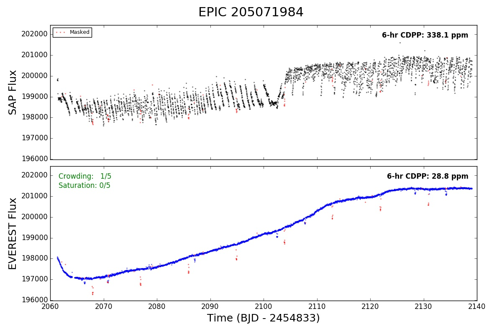

Quick Access
============

For quick access to the light curves in the catalog,
you can use the :py:mod:`everest` command line tool. 

.. note:: This is useful for a quick visual inspection of the light curves and other \
          diagnostic plots. Users who wish to do science with the light curves should \
          also check out the `Running Everest <running_everest.html>`_ section.

Open up a terminal and call

.. code-block:: bash

   everest 205071984

to bring up a window with the raw and de-trended light curves
for EPIC 205071984:

The :py:mod:`everest` command accepts several options, which we list below.

====================  =================================================================================
:py:obj:`epic`        The **EPIC** target number (`required`)
:py:obj:`-a`          Plot the aperture used for the photometry
:py:obj:`-c`          Plot the location of the target on the CCD
:py:obj:`-i`          Plot in interactive mode
:py:obj:`-n`          Plot the contamination analysis
:py:obj:`-p`          Plot the **EVEREST** de-trended light curve (`default`)
:py:obj:`-r`          Plot the autocorrelation/GP fitting result
:py:obj:`-s`          Plot the postage stamp for the target  
:py:obj:`-x`          Plot the cross-validation analysis
:py:obj:`--k2sff`     Plot the **K2SFF** light curve for the target
:py:obj:`--k2sc`      Plot the **K2SC** light curve for the target
:py:obj:`--k2varcat`  Plot the **K2SVARCAT** light curve for the target
====================  =================================================================================