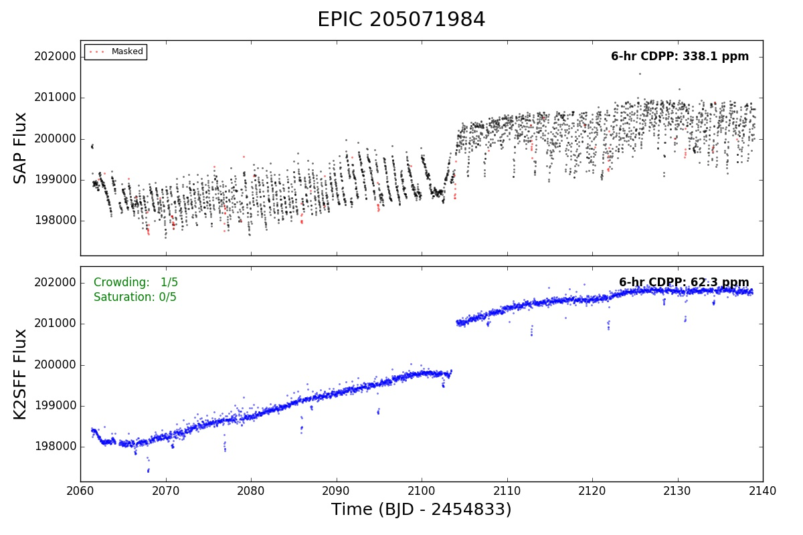
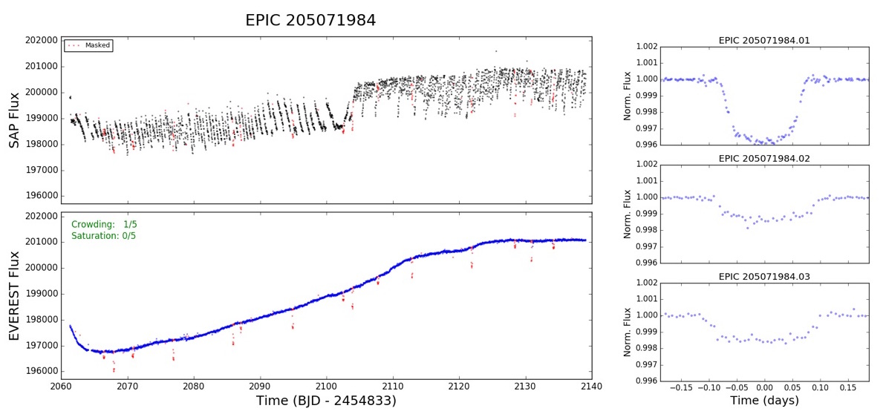
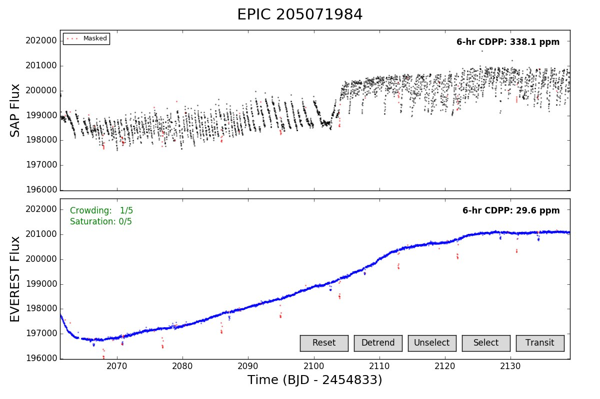
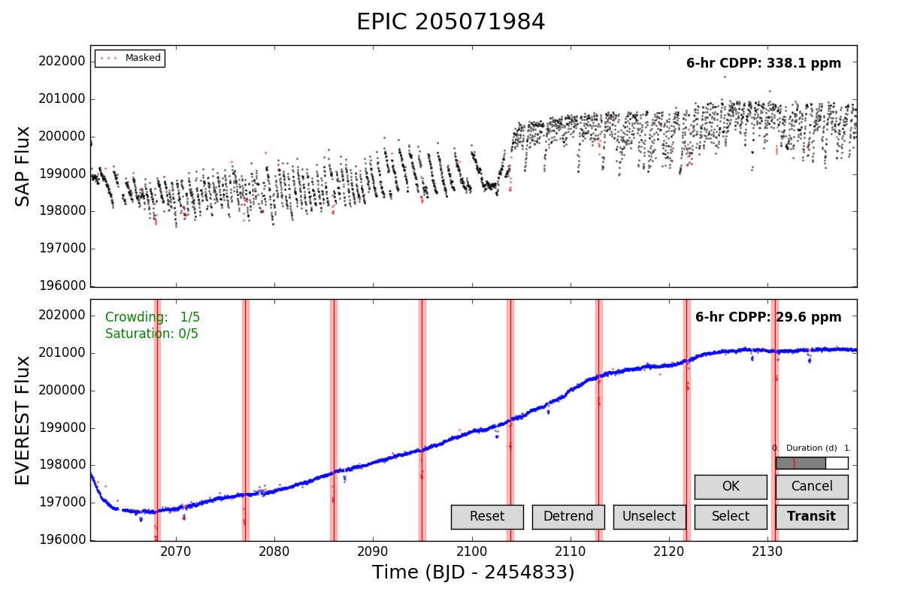
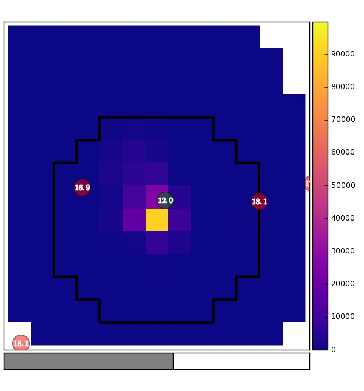

Running Everest
===============

The :py:mod:`everest` package includes both the source code used to generate the
`EVEREST catalog <https://archive.stsci.edu/missions/hlsp/everest/>`_ (i.e., the
pipeline) and source code for downloading and interfacing with the catalog.
Since most users will be interested in the latter, we begin by describing the
user-facing portion of the code.

.. contents::
   :local:
    
User Tools
----------
  
The Basics
~~~~~~~~~~

All user tools are conveniently located in the :py:mod:`everest.usertools`
submodule and can be accessed in a simple Python script. Data access, de-trending, 
and plotting are all done via the
:py:class:`everest.usertools.Everest` class, as follows:

.. code-block:: python
  
    from everest import Everest
    star = Everest(205071984)

This instantiates an :py:class:`everest.usertools.Everest` object for the target
``EPIC 205071984``, a campaign 2 star known to host at least three planet candidates.
The :py:mod:`everest` FITS file for this target is automatically downloaded and cached
in the `~/.everest/fits` directory. This file contains all the information generated
by the :py:mod:`everest` pipeline, which can be used to interact with the de-trended data.
If all we want is the de-trended light curve, that's easy: the arrays

.. code-block:: python
  
    time = star.time
    flux = star.flux

store the de-trended fluxes. These can easily be plotted by calling

.. code-block:: python
  
    import matplotlib.pyplot as pl
    star.plot() 
    pl.show()

which displays the following plot:

.. figure:: running_everest1.jpeg
   :width: 800px
   :align: center
   :height: 100px
   :figclass: align-center

The output can easily be compared with that of other pipelines available on the MAST
archive. To plot the equivalent K2SFF light curve, simply call

.. code-block:: python

  star.plot(pipeline = 'k2sff') 
  pl.show()

Custom Masks
~~~~~~~~~~~~

If you're using :py:mod:`everest` for exoplanet/eclipsing binary science, you will
likely want to apply a mask to any transits in the light curve to prevent
the transits from getting washed out by the least-squares fitting step. The de-trended
light curves provided in the catalog automatically mask out large outliers, but it is
still strongly recommended that all transits be masked during the de-trending step
to minimize de-trending bias. This can be done **easily** and **quickly** as follows:

.. code-block:: python
  
    star.set_mask(transits = [( 8.992, 2067.93, 0.25),
                              (20.661, 2066.42, 0.25),
                              (31.716, 2070.79, 0.25)])

In the snippet above, we tell :py:mod:`everest` to mask three transiting planets.
The first element in each sublist is the period, in days, of the planet. The second
element is the time of first transit (BJD - 2454833), and the third is the
total transit duration, also in days.

Running the line above should take about one second; :py:mod:`everest` automatically
de-trends the data with this custom mask (since it's a linear model, it's **super** fast).
To see the results, call

.. code-block:: python

    star.plot() 
    pl.show()

You may also want to see what the folded transits look like. You can do that easily
by running

.. code-block:: python

    star.plot_folded() 
    pl.show()

The following two plots should be generated:

Interactive Mode
~~~~~~~~~~~~~~~~

Transit masks can also be applied interactively. To see how this works, call

.. code-block:: python

    star.plot(interactive = True)

The buttons at the bottom right can be used to specify custom masks. Use
``Select`` and ``Unselect`` to select/unselect ranges of data points to
mask; these will appear in red. Once all masks have been selected, click
``Detrend`` to de-trend the light curve. After a second or two, the
new de-trended light curve will display. This new light curve can now
be accessed via the :py:obj:`star.time` and :py:obj:`star.flux` arrays. To
reset to the original masks, click ``Reset``.

Alternatively, masks can be applied for periodic transits by clicking the
``Transit`` button:

Click on any two adjacent transits (you may want to zoom in for this) to 
specify the mask. The transit duration can be adjusted with the slider
above the ``OK`` and ``Cancel`` buttons. Click ``OK`` and then ``Detrend``
to see the results.

Additional Stuff
~~~~~~~~~~~~~~~~

Another useful method of the :py:class:`everest.usertools.Everest` class is
the :py:meth:`Everest.postage_stamp` method. This downloads the raw `K2`
FITS file and plots the target's postage stamp:

.. code-block:: python

  star.postage_stamp() 
  pl.show()

The aperture used by :py:mod:`everest` is indicated with a black outline; sources
in the EPIC catalog are indicated with circles (green is the target, red are
neighboring sources). Their `Kepler` magnitudes are also indicated. Finally, a 
slider is present at the bottom of the plot; this may be dragged to see the
evolution of the postage stamp over the course of the full campaign.

You can also call 

.. code-block:: python

  star.ccd() 
  pl.show()

to view the location of the target on the `Kepler` CCD.

The Pipeline
------------

A detailed description of the pipeline is available in our paper. I'll add some
general notes here shortly. For now, please check out the `code section <modules.html>`_.