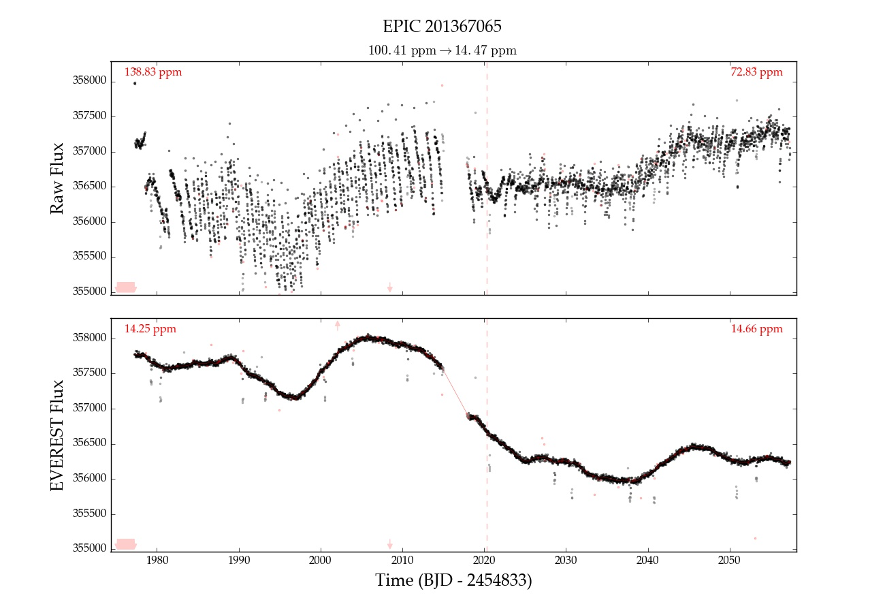
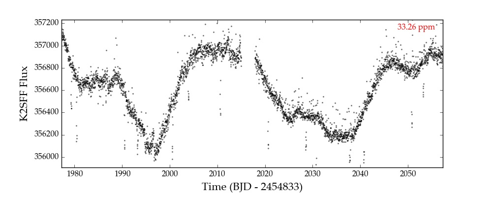
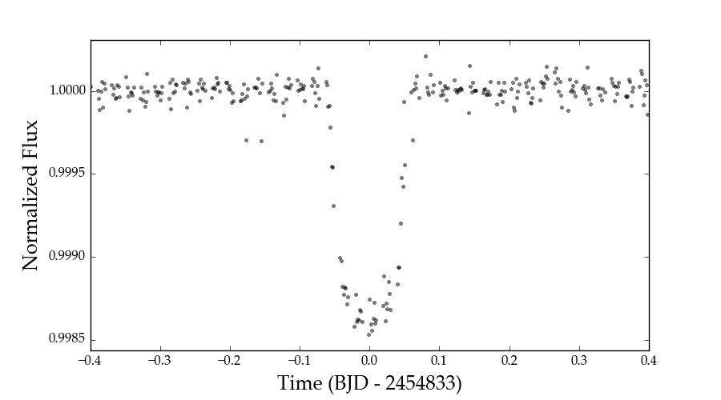

Using Everest
-------------

.. role:: python(code)
   :language: python

There are two ways of interacting with the :py:obj:`everest` catalog: via the command line and 
through the Python interface. For quick visualization, check out the :doc:`everest <everest>` and
:doc:`estats <estats>` command line tools.
For customized access to de-trended light curves in Python, keep reading!

.. contents::
   :local:

A Simple Example
================

Once you've installed :py:obj:`everest`, you can easily import it in Python:

.. code-block :: python
   
   import everest

Say we're interested in **EPIC 201367065**, a :py:obj:`K2` transiting exoplanet host star.
Let's instantiate the :py:class:`Everest <everest.user.Everest>` class for this target:

.. code-block :: python
   
   star = everest.Everest(201367065)

You will see the following printed to the screen:

.. code-block :: bash
  
   INFO  [everest.user.DownloadFile()]: Downloading the file...
   INFO  [everest.user.load_fits()]: Loading FITS file for 201367065.

Everest automatically downloaded the light curve and created an object containing all of
the de-trending information. For more information on the various methods and attributes 
of :py:obj:`star`, check out the 
:py:class:`everest.Detrender <everest.detrender.Detrender>` documentation (from which 
:py:class:`Everest <everest.user.Everest>` inherits a bunch of parameters) and the
:py:class:`Everest <everest.user.Everest>` docstring.

To bring up the DVS (:doc:`data validation summary <dvsfigs>`) for the target, execute

.. code-block :: python
   
   star.dvs()

You can also plot it interactively:

.. code-block :: python
  
   star.plot()

The raw light curve is shown at the top and the de-trended light curve at the bottom.
The 6 hr CDPP (a photometric precision metric) is shown at the top of each plot in
red. Since this light curve was de-trended with a break point, which divides it into
two separate segments, the CDPP is shown for each one. At the top, below the title,
we indicate the CDPP for the entire light curve (raw → de-trended). Outliers are 
indicated in red, and arrows indicate points that are beyond the limits of the plot
(zoom out to see them). You can read more about these plots :doc:`here <dvsfigs>`.

Finally, if you want to manipulate the light curve yourself, the timeseries is stored
in :python:`star.time` and :python:`star.flux` (PLD-de-trended flux) or :python:`star.fcor` (de-trended
flux with CBV correction). The indices of all outliers are stored in :python:`star.mask`.

Masking Transits
================

If you're using :py:obj:`everest` for exoplanet/eclipsing binary science, you will
likely want to apply a mask to any transits in the light curve to prevent
them from getting washed out by the least-squares fitting step. The de-trended
light curves provided in the catalog automatically mask large outliers, but it is
still strongly recommended that all transits be masked during the de-trending step
to minimize de-trending bias. This can be done **easily** and **quickly** as follows:

.. code-block:: python
  
    star.mask_planet(t0, per, dur = 0.2)
    star.compute()

where :python:`t0` is the time of first transit, :python:`per` is the period,
and :python:`dur` is the full transit duration (all in days).

Alternatively, you can specify directly which indices in the light curve should be masked by
setting the :python:`star.transitmask` attribute:

.. code-block:: python
  
    star.transit_mask = np.array([0, 1, 2, ...], dtype = int)
    star.compute()

Note that this does not overwrite outlier masks, which are stored in the
:python:`star.outmask`, :python:`star.badmask`, and :python:`star.nanmask` arrays.

.. note :: You must run the :py:meth:`compute <everest.basecamp.Basecamp.compute>` method \
           for the model to be re-trained on the out-of-transit data. Running \
           :py:meth:`compute <everest.basecamp.Basecamp.compute>` typically takes a few \
           seconds. For short cadence light curves, it may take a minute or two.

CBV Corrections
===============

The :py:obj:`everest` pipeline automatically corrects de-trended light curves
with a single co-trending basis vector (CBV) calculated from all the de-trended
light curves observed during that season/campaign. The CBV-corrected flux is stored
in :python:`star.fcor` and is the quantity that is plotted by default when the user calls
:python:`star.plot()` (the uncorrected, de-trended flux is :python:`star.flux`).

Sometimes, it is desirable to correct the light curve with a different number of CBVs.
For :py:obj:`K2`, :py:obj:`everest` calculates 5 CBVs for each campaign, so any number
from 0-5 is possible. To correct the light curve with 2 CBVs, run

.. code-block :: python
   
   star.cbv_num = 2
   star.compute()
 
Plotting the light curve will now show the flux corrected with two CBVs.
 
.. note :: The :py:obj:`everest` catalog uses only 1 CBV to prevent fitting out \
           real astrophysical variability. Care must be taken when using more CBVs \
           to ensure this is not the case.

Here is an example of **EPIC 201367065** corrected with 0, 1, 2, 3, and 4 CBVs. Note that
the fourth CBV appears to *introduce* extra variability; at that point, the correction
is likely overfitting.

+--------------------+-------------------------------------+
| **Number of CBVs** | **De-trended light curve**          |
+====================+=====================================+
| **0**              | .. figure:: everest_0cbv.jpeg       |
|                    |    :width: 400px                    |
|                    |    :align: center                   |
|                    |    :figclass: align-center          |
+--------------------+-------------------------------------+
| **1**              | .. figure:: everest_1cbv.jpeg       |
|                    |    :width: 400px                    |
|                    |    :align: center                   |
|                    |    :figclass: align-center          |
+--------------------+-------------------------------------+
| **2**              | .. figure:: everest_2cbv.jpeg       |
|                    |    :width: 400px                    |
|                    |    :align: center                   |
|                    |    :figclass: align-center          |
+--------------------+-------------------------------------+
| **3**              | .. figure:: everest_3cbv.jpeg       |
|                    |    :width: 400px                    |
|                    |    :align: center                   |
|                    |    :figclass: align-center          |
+--------------------+-------------------------------------+
| **4**              | .. figure:: everest_4cbv.jpeg       |
|                    |    :width: 400px                    |
|                    |    :align: center                   |
|                    |    :figclass: align-center          |
+--------------------+-------------------------------------+

.. note :: The CBVs are stored as column vectors in the :python:`star.XCBV` design matrix.

Tuning the Model
================

The :py:meth:`cross-validation step <everest.detrender.Detrender.cross_validate>` seeks
to find the optimal value of the regularization parameter :python:`lambda` for each
PLD order. These are stored in the :python:`star.lam` array, which has shape 
:python:`(nsegments, pld_order)`. Changing these numbers will change the PLD weights
and thus the de-trending power, but it will likely lead to underfitting/overfitting.
Nevertheless, in cases where the optimization fails, tweaking of these numbers could
be useful. Here's the :python:`star.lam` array for **EPIC 201367065**:

.. code-block :: python

   [[3.16e05, 3.16e11, 1.0e11],
    [1.00e09, 1.00e09, 1.e09]]

We can compute the second order PLD model by zeroing out the third order elements:

.. code-block :: python

   star.lam = [[3.16e05, 3.16e11, 0.],
               [1.00e09, 1.00e09, 0.]]
   star.compute()

Pipeline Comparison
===================

It's easy to plot the light curve de-trended with different pipelines:

.. code-block :: python

   star.plot_pipeline('everest1')
   star.plot_pipeline('k2sff')
   star.plot_pipeline('k2sc')

Here's **EPIC 201367065** de-trended with :py:obj:`K2SFF`:

Folded Transits
===============

If there are transits/eclipses in a light curve, :py:mod:`everest` can use the GP
prediction to whiten the timeseries and fold it on the period of the planet.
If the time of first transit and period of an exoplanet/EB are known, plotting the
folded transit/eclipse is easy. Just remember to mask the transit and re-compute
the model beforehand:

.. code-block :: python
   
   star.mask_planet(1980.42, 10.054)
   star.compute()
   star.plot_folded(1980.42, 10.054)

.. raw:: html

  